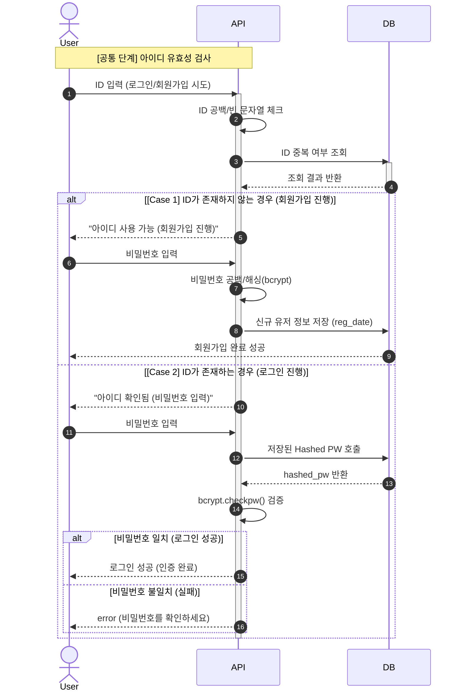
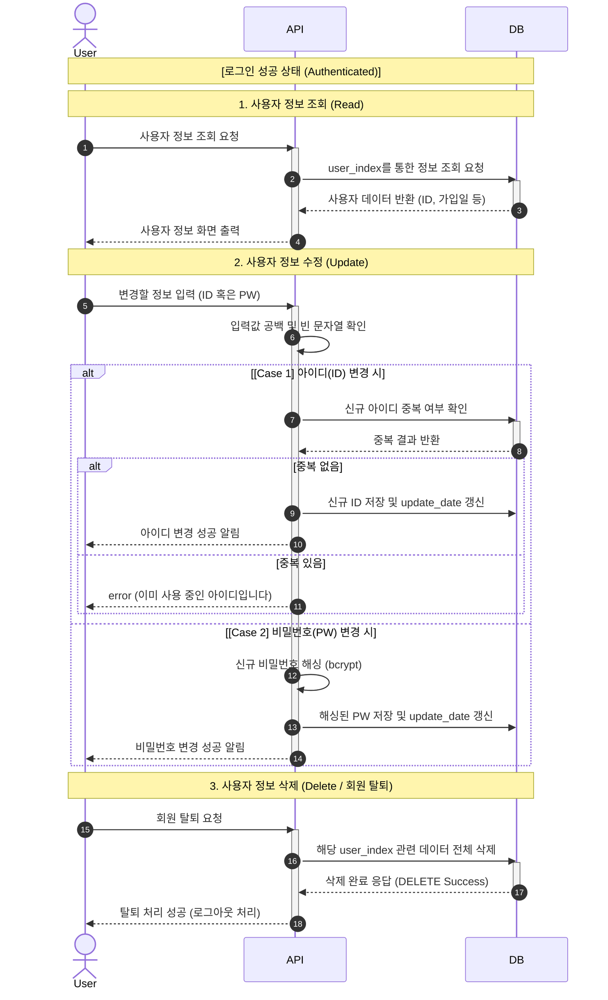
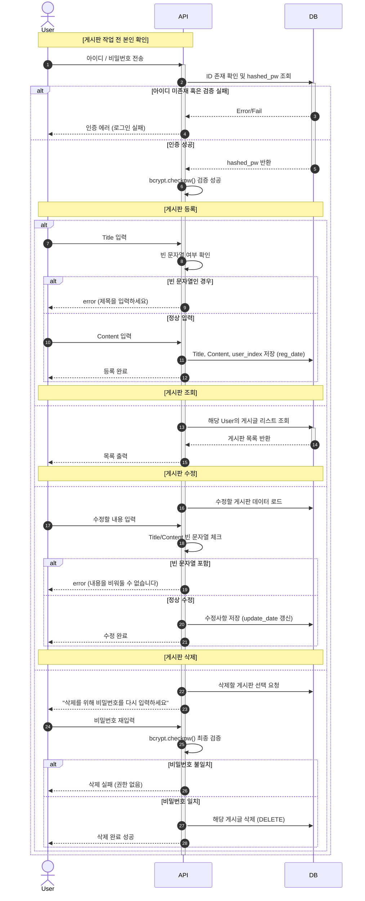

# 📌 프로젝트 소개
---
본 프로젝트는 **회원관리 및 게시판 기능을 포함한 백엔드 시스템**을 구현한 프로젝트입니다.  

사용자는 회원가입 및 로그인 후 게시글을 작성하고, 회원정보 및 게시글을 수정, 삭제할 수 있습니다.

또한 FastAPI 기반으로 설계하여 비동기 처리 성능과 확장성, 유지보수성을 고려하였습니다.

---

# ⚙️ 개발 스펙 및 개발 환경
## 🧩 Backend
- **Language**: Python 3.12.3
- **Framework**: FastAPI
- **Security**: Bcrypt (Password Hashing), JWT (Token Auth)

## 🗄️ Database & Storage
- **DBMS**: PostgreSQL
- **Driver**: Asyncpg (Asynchronous Python driver)

## 🛠️ Tools
- **IDE**: VS Code
- **Version Control**: Git, GitHub
- **API Test**: Swagger UI (Built-in), Postman
---

# 🚀 주요 기능

## 👤 회원 관리
- 회원가입 / 로그인 / 로그아웃
- 🔐 비밀번호 암호화 저장 (BCrypt)
- 사용자 정보 조회, 수정, 삭제

---

## 📝 게시판 기능
- 게시글 작성 / 조회 / 수정 / 삭제 (CRUD)
- 📋 게시글 목록 조회 (페이징 처리)
- 🔍 게시글 수정 및 삭제

---

# 🧱 프로젝트 구조
여기에 파일 구조 

---

# 🏗️ 시스템 아키텍처
여기에 mermaid로 그린 시퀀스 다이어그램 

---

# 📡 API 예시

## 🔐 회원가입
POST /

## 🔑 로그인
POST /

## 📝 게시글 작성
POST /

## 📋 게시글 목록 조회
GET /

---

# 🧪 테스트 방법

- Swagger을 활용한 API 테스트
---

# ✨ 향후 개선 사항

- 🔍 게시글 검색 고도화 (Full Text Search)
- 📷 이미지 업로드 기능 추가
- 👍 좋아요 기능
- 🧾 API 문서화 (Swagger)
