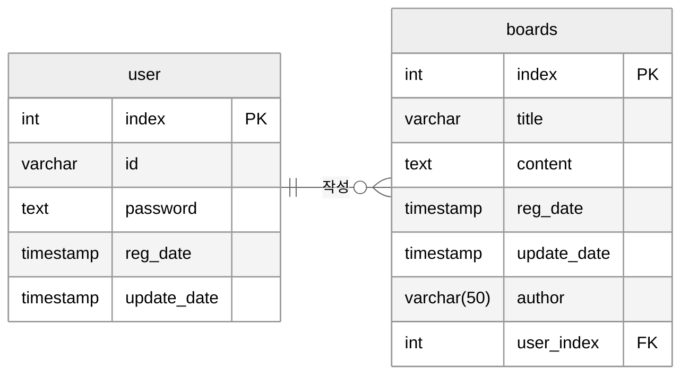

# 💻 Board & User Management Backend System
회원관리 및 게시판 관리 기능을 포함한 백엔드 시스템 구현 프로그램

[](https://www.python.org/) 
[](https://fastapi.tiangolo.com/) 
[](https://www.postgresql.org/)

---

## 📋 목차
- [프로젝트 소개](#-프로젝트-소개)

- [개발 스펙 및 개발 환경](#-개발-스펙-및-개발-환경)

- [주요 기능](#-주요-기능)

- [시스템 아키텍처](#-시스템-아키텍처)

- [API](#-API)

---

## 📌 프로젝트 소개
본 프로젝트는 **회원관리 및 게시판 기능을 포함한 백엔드 시스템**을 구현한 프로젝트입니다.  

사용자는 회원가입 및 로그인 후 게시글을 작성하고, 회원정보 및 게시글을 수정, 삭제할 수 있습니다.

또한 FastAPI 기반으로 설계하여 비동기 처리 성능과 확장성, 유지보수성을 고려하였습니다.

### 🎯 핵심 목표 
✅ 사용자 비밀번호를 bcrypt 모듈로 암호화하여 DB에 저장

✅ 

✅

---

## ⚙️ 개발 스펙 및 개발 환경
### 🧩 Backend
- **Language**: Python 3.12.3
- **Framework**: FastAPI
- **Security**: Bcrypt (Password Hashing), JWT (Token Auth)

### 🗄️ Database & Storage
- **DBMS**: PostgreSQL
- **Driver**: Asyncpg (Asynchronous Python driver)

### 🛠️ Tools
- **IDE**: VS Code
- **Version Control**: Git, GitHub
- **API Test**: Swagger UI (Built-in), Postman

---

## ✨ 주요 기능
### 👤 회원 관리
- 회원가입 / 로그인 / 로그아웃
- 비밀번호 암호화 저장 (BCrypt)
- 사용자 정보 조회, 수정, 삭제

---

### 📝 게시판 기능
- 게시글 작성 / 조회 / 수정 / 삭제 (CRUD)
- 게시글 목록 조회 (페이징 처리)

---

## 🏗️ 시스템 아키텍처
### 📊 시스템 다큐먼트
- [인증 로직 상세 (Auth Flow)](./docs/auth_flow.md)
- [사용자 관리 로직 상세 (User Flow)](./docs/user_flow.md)
- [게시판 CRUD 로직 상세 (Board Flow)](./docs/boards_flow.md)

### 📁 프로젝트 구조 

```text
.
├── README.md
├── boards.py
├── database.py
├── 📁docs
│   ├── auth_flow.md
│   ├── boards_flow.md
│   └── user_flow.md
├── encryption.py
├── main.py
├── user.py
└── util.py
```

### 🗃️ 데이터베이스 스키마
### 테이블 구조


### 테이블 설명 
표로 만들어서 각 테이블 설명

---

## 📡 API

[API 상세 명세서]( 여기에 링크 )
[Swagger UI]( 여기에 링크 )를 참조하세요.

| Category | Method | Endpoint | Description |
| :--- | :---: | :--- | :--- |
| **Auth** | `POST` | `/ucheck` | ID 중복 확인 및 PW 유효성 검사 |
| **User** | `POST` | `/uregister` | 신규 회원 등록 (Bcrypt 암호화) |
| **User** | `POST` | `/blogin` | 사용자 인증 및 로그인 |
| **Board** | `POST` | `/bregister` | 신규 게시글 등록 (제목 공백 검증) |
| **Board** | `POST` | `/bupdate` | 게시글 수정 및 PW 재인증 후 삭제 |


---
