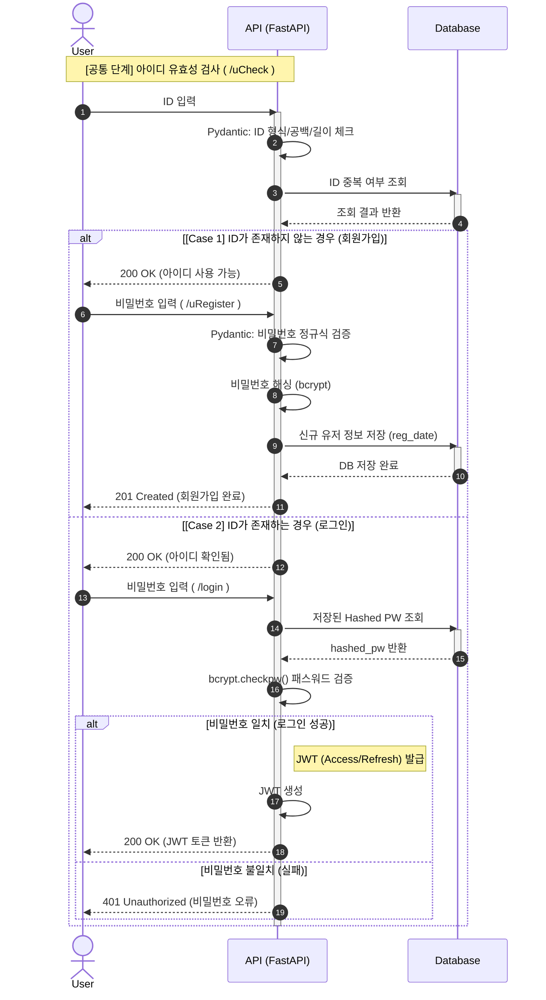

```mermaid
sequenceDiagram
    autonumber
    actor U as User
    participant A as API (FastAPI)
    participant D as Database

    Note over U, A: [공통 단계] 아이디 유효성 검사 ( /uCheck )

    U->>A: ID 입력
    activate A
    A->>A: Pydantic: ID 형식/공백/길이 체크
    A->>D: ID 중복 여부 조회
    activate D
    D-->>A: 조회 결과 반환
    deactivate D

    alt [Case 1] ID가 존재하지 않는 경우 (회원가입)
        A-->>U: 200 OK (아이디 사용 가능)
        U->>A: 비밀번호 입력 ( /uRegister )
        A->>A: Pydantic: 비밀번호 정규식 검증
        A->>A: 비밀번호 해싱 (bcrypt)
        A->>D: 신규 유저 정보 저장 (reg_date)
        activate D
        D-->>A: DB 저장 완료
        deactivate D
        A-->>U: 201 Created (회원가입 완료)

    else [Case 2] ID가 존재하는 경우 (로그인)
        A-->>U: 200 OK (아이디 확인됨)
        U->>A: 비밀번호 입력 ( /login )
        A->>D: 저장된 Hashed PW 조회
        activate D
        D-->>A: hashed_pw 반환
        deactivate D
        
        A->>A: bcrypt.checkpw() 패스워드 검증

        alt 비밀번호 일치 (로그인 성공)
            Note right of A: JWT (Access/Refresh) 발급
            A->>A: JWT 생성 
            A-->>U: 200 OK (JWT 토큰 반환)
        else 비밀번호 불일치 (실패)
            A-->>U: 401 Unauthorized (비밀번호 오류)
        end
    end
    deactivate A
```