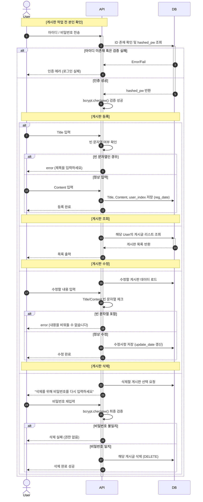

```mermaid
sequenceDiagram
    autonumber
    actor U as User
    participant A as API
    participant D as DB

    Note over U, A: [게시판 작업 전 본인 확인]
    U->>A: 아이디 / 비밀번호 전송
    activate A
    A->>D: ID 존재 확인 및 hashed_pw 조회
    activate D
    alt 아이디 미존재 혹은 검증 실패
        D-->>A: Error/Fail
        A-->>U: 인증 에러 (로그인 실패)
    else 인증 성공
        D-->>A: hashed_pw 반환
        deactivate D
        A->>A: bcrypt.checkpw() 검증 성공
        
        Note over U, D: [게시판 등록]
        alt
            U->>A: Title 입력
            A->>A: 빈 문자열 여부 확인
            alt 빈 문자열인 경우
                A-->>U: error (제목을 입력하세요)
            else 정상 입력
                U->>A: Content 입력
                A->>D: Title, Content, user_index 저장 (reg_date)
                A-->>U: 등록 완료
            end

        Note over U, D: [게시판 조회]
        else
            A->>D: 해당 User의 게시글 리스트 조회
            activate D
            D-->>A: 게시판 목록 반환
            deactivate D
            A-->>U: 목록 출력

        Note over U, D: [게시판 수정]
        else
            A->>D: 수정할 게시판 데이터 로드
            U->>A: 수정할 내용 입력
            A->>A: Title/Content 빈 문자열 체크
            alt 빈 문자열 포함
                A-->>U: error (내용을 비워둘 수 없습니다)
            else 정상 수정
                A->>D: 수정사항 저장 (update_date 갱신)
                A-->>U: 수정 완료
            end

        Note over U, D: [게시판 삭제]
        else
            A->>D: 삭제할 게시판 선택 요청
            A-->>U: "삭제를 위해 비밀번호를 다시 입력하세요"
            U->>A: 비밀번호 재입력
            A->>A: bcrypt.checkpw() 최종 검증
            alt 비밀번호 불일치
                A-->>U: 삭제 실패 (권한 없음)
            else 비밀번호 일치
                A->>D: 해당 게시글 삭제 (DELETE)
                A-->>U: 삭제 완료 성공
            end
        end
    end
    deactivate A
```