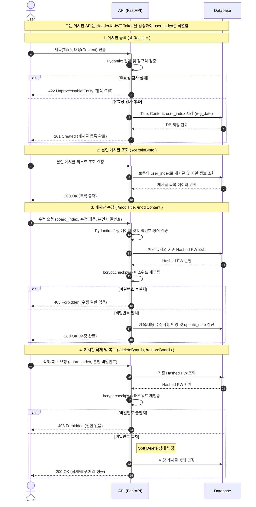

```mermaid
sequenceDiagram
    autonumber
    actor U as User
    participant A as API (FastAPI)
    participant D as Database

    Note over U, D: 모든 게시판 API는 Header의 JWT Token을 검증하여 user_index를 식별함

    Note over U, D: 1. 게시판 등록 ( /bRegister )
    U->>A: 제목(Title), 내용(Content) 전송
    activate A
    A->>A: Pydantic: 길이 및 정규식 검증
    alt 유효성 검사 실패
        A-->>U: 422 Unprocessable Entity (형식 오류)
    else 유효성 검사 통과
        A->>D: Title, Content, user_index 저장 (reg_date)
        activate D
        D-->>A: DB 저장 완료
        deactivate D
        A-->>U: 201 Created (게시글 등록 완료)
    end
    deactivate A

    Note over U, D: 2. 본인 게시판 조회 ( /certainBInfo )
    U->>A: 본인 게시글 리스트 조회 요청
    activate A
    A->>D: 토큰의 user_index로 게시글 및 파일 정보 조회
    activate D
    D-->>A: 게시글 목록 데이터 반환
    deactivate D
    A-->>U: 200 OK (목록 출력)
    deactivate A

    Note over U, D: 3. 게시판 수정 ( /modiTitle, /modiContent )
    U->>A: 수정 요청 (board_index, 수정 내용, 본인 비밀번호)
    activate A
    A->>A: Pydantic: 수정 데이터 및 비밀번호 형식 검증
    
    A->>D: 해당 유저의 기존 Hashed PW 조회
    activate D
    D-->>A: Hashed PW 반환
    deactivate D
    A->>A: bcrypt.checkpw() 패스워드 재인증

    alt 비밀번호 불일치
        A-->>U: 403 Forbidden (수정 권한 없음)
    else 비밀번호 일치
        A->>D: 제목/내용 수정사항 반영 및 update_date 갱신
        A-->>U: 200 OK (수정 완료)
    end
    deactivate A

    Note over U, D: 4. 게시판 삭제 및 복구 ( /deleteBoards, /restoreBoards )
    U->>A: 삭제/복구 요청 (board_index, 본인 비밀번호)
    activate A
    
    A->>D: 기존 Hashed PW 조회
    activate D
    D-->>A: Hashed PW 반환
    deactivate D
    A->>A: bcrypt.checkpw() 패스워드 재인증

    alt 비밀번호 불일치
        A-->>U: 403 Forbidden (권한 없음)
    else 비밀번호 일치
        Note right of A: Soft Delete 상태 변경
        A->>D: 해당 게시글 상태 변경 
        A-->>U: 200 OK (삭제/복구 처리 성공)
    end
    deactivate A
```