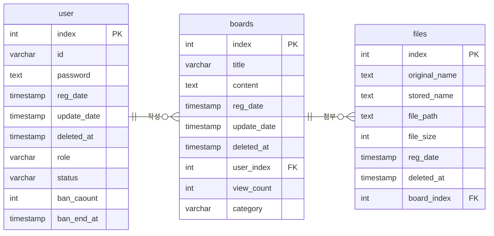

```mermaid
erDiagram
    direction LR
    user {
        int index PK
        varchar id
        text password
        timestamp reg_date
        timestamp update_date
        timestamp deleted_at
        varchar role
        varchar status
        int ban_caount
        timestamp ban_end_at
    }

    boards {
        int index PK
        varchar title
        text content
        timestamp reg_date
        timestamp update_date
        timestamp deleted_at
        int user_index FK
        int view_count
        varchar category
    }

    files {
        int index PK
        text original_name
        text stored_name
        text file_path
        int file_size
        timestamp reg_date
        timestamp deleted_at
        int board_index FK
    }
    user ||--o{ boards : "작성"
    boards ||--o{ files : "첨부"
```