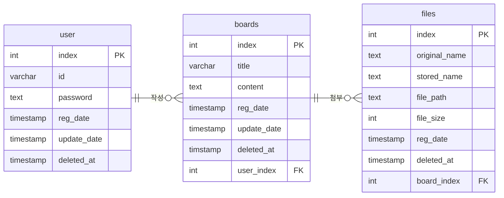

```mermaid
erDiagram
    direction LR
    user {
        int index PK ""  
        varchar id  ""  
        text password  ""  
        timestamp reg_date  ""  
        timestamp update_date  ""  
        timestamp deleted_at  ""  
    }

    boards {
        int index PK ""  
        varchar title  ""  
        text content  ""  
        timestamp reg_date  ""  
        timestamp update_date  ""  
        timstamp deleted_at  ""  
        int user_index FK ""  
    }

    files {
        int index PK ""  
        text original_name  ""  
        text stored_name  ""  
        text file_path  ""  
        int file_size  ""  
        timestamp reg_date  ""  
        timestamp deleted_at  ""  
        int board_index FK ""  
    }

    user||--o{boards:"작성"
    boards||--o{files: "첨부"
```
