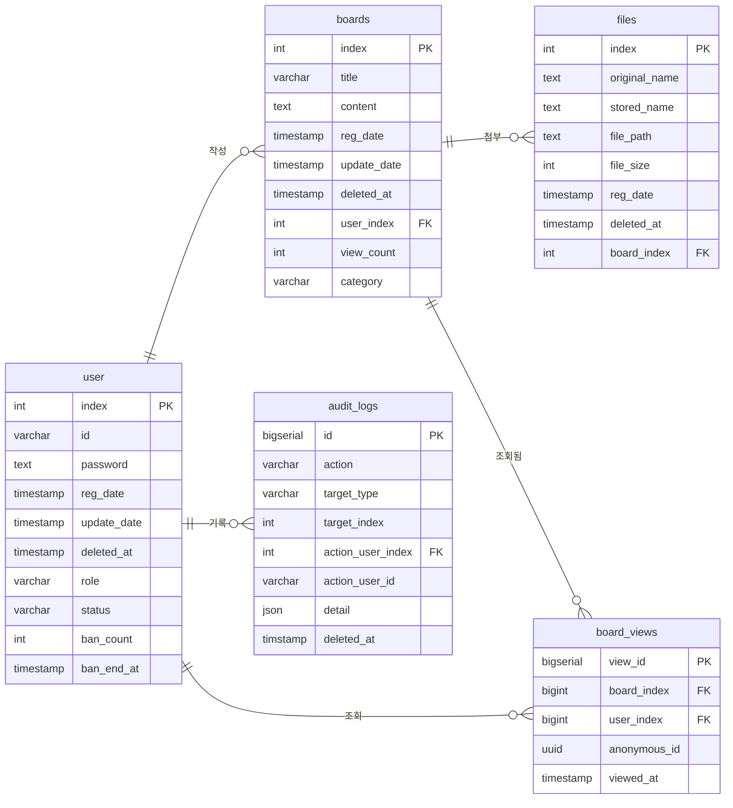

```mermaid
erDiagram
	direction LR
	user {
		int index PK ""  
		varchar id  ""  
		text password  ""  
		timestamp reg_date  ""  
		timestamp update_date  ""  
		timestamp deleted_at  ""  
		varchar role  ""  
		varchar status  ""  
		int ban_count  ""  
		timestamp ban_end_at  ""  
	}

	boards {
		int index PK ""  
		varchar title  ""  
		text content  ""  
		timestamp reg_date  ""  
		timestamp update_date  ""  
		timestamp deleted_at  ""  
		int user_index FK ""  
		int view_count  ""  
		varchar category  ""  
	}

	files {
		int index PK ""  
		text original_name  ""  
		text stored_name  ""  
		text file_path  ""  
		int file_size  ""  
		timestamp reg_date  ""  
		timestamp deleted_at  ""  
		int board_index FK ""  
	}

	audit_logs {
		bigserial id PK ""  
		varchar action  ""  
		varchar target_type  ""  
		int target_index  ""  
		int action_user_index FK ""  
		varchar action_user_id  ""  
		json detail  ""  
		timstamp deleted_at  ""  
	}

	user ||--o{ boards : "작성"
    user ||--o{ audit_logs : "기록"
    user ||--o{ board_views : "조회"
    boards ||--o{ files : "첨부"
    boards ||--o{ board_views : "조회됨"

    board_views {
        bigserial view_id PK
        bigint board_index FK
        bigint user_index FK
        uuid anonymous_id
		timestamp viewed_at
    }
```