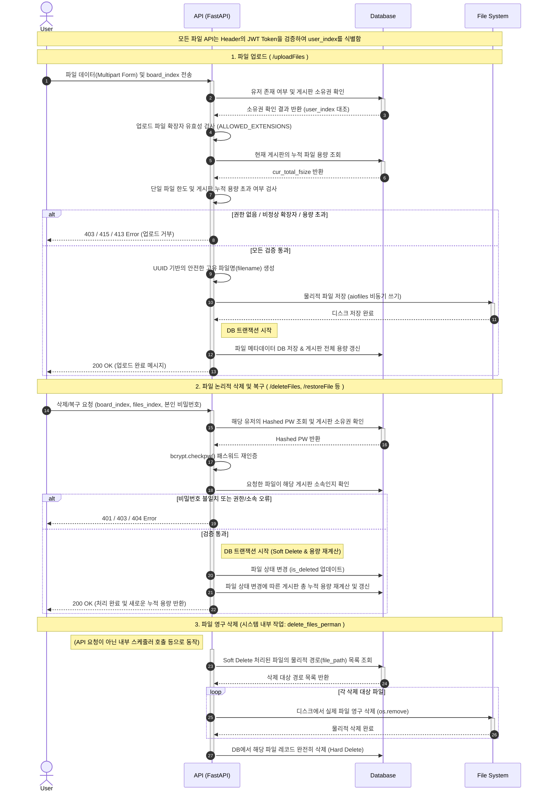

```mermaid
sequenceDiagram
    autonumber
    actor U as User
    participant A as API (FastAPI)
    participant D as Database
    participant S as File System

    Note over U, S: 모든 파일 API는 Header의 JWT Token을 검증하여 user_index를 식별함

    Note over U, S: 1. 파일 업로드 ( /uploadFiles )
    U->>A: 파일 데이터(Multipart Form) 및 board_index 전송
    activate A
    A->>D: 유저 존재 여부 및 게시판 소유권 확인
    activate D
    D-->>A: 소유권 확인 결과 반환 (user_index 대조)
    deactivate D
    
    A->>A: 업로드 파일 확장자 유효성 검사 (ALLOWED_EXTENSIONS)
    
    A->>D: 현재 게시판의 누적 파일 용량 조회
    activate D
    D-->>A: cur_total_fsize 반환
    deactivate D
    
    A->>A: 단일 파일 한도 및 게시판 누적 용량 초과 여부 검사
    
    alt 권한 없음 / 비정상 확장자 / 용량 초과
        A-->>U: 403 / 415 / 413 Error (업로드 거부)
    else 모든 검증 통과
        A->>A: UUID 기반의 안전한 고유 파일명(filename) 생성
        A->>S: 물리적 파일 저장 (aiofiles 비동기 쓰기)
        activate S
        S-->>A: 디스크 저장 완료
        deactivate S
        
        Note right of A: DB 트랜잭션 시작
        A->>D: 파일 메타데이터 DB 저장 & 게시판 전체 용량 갱신
        A-->>U: 200 OK (업로드 완료 메시지)
    end
    deactivate A

    Note over U, S: 2. 파일 논리적 삭제 및 복구 ( /deleteFiles, /restoreFile 등 )
    U->>A: 삭제/복구 요청 (board_index, files_index, 본인 비밀번호)
    activate A
    
    A->>D: 해당 유저의 Hashed PW 조회 및 게시판 소유권 확인
    activate D
    D-->>A: Hashed PW 반환
    deactivate D
    
    A->>A: bcrypt.checkpw() 패스워드 재인증
    A->>D: 요청한 파일이 해당 게시판 소속인지 확인
    
    alt 비밀번호 불일치 또는 권한/소속 오류
        A-->>U: 401 / 403 / 404 Error
    else 검증 통과
        Note right of A: DB 트랜잭션 시작 (Soft Delete & 용량 재계산)
        A->>D: 파일 상태 변경 (is_deleted 업데이트)
        A->>D: 파일 상태 변경에 따른 게시판 총 누적 용량 재계산 및 갱신
        A-->>U: 200 OK (처리 완료 및 새로운 누적 용량 반환)
    end
    deactivate A

    Note over U, S: 3. 파일 영구 삭제 (시스템 내부 작업: delete_files_perman )
    Note left of A: (API 요청이 아닌 내부 스케줄러 호출 등으로 동작)
    activate A
    A->>D: Soft Delete 처리된 파일의 물리적 경로(file_path) 목록 조회
    activate D
    D-->>A: 삭제 대상 경로 목록 반환
    deactivate D
    
    loop 각 삭제 대상 파일
        A->>S: 디스크에서 실제 파일 영구 삭제 (os.remove)
        activate S
        S-->>A: 물리적 삭제 완료
        deactivate S
    end
    A->>D: DB에서 해당 파일 레코드 완전히 삭제 (Hard Delete)
    deactivate A
```