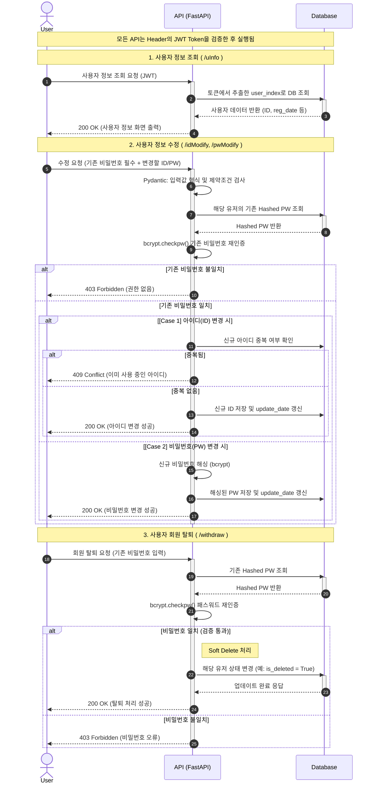

```mermaid
sequenceDiagram
    autonumber
    actor U as User
    participant A as API (FastAPI)
    participant D as Database

    Note over U, D: 모든 API는 Header의 JWT Token을 검증한 후 실행됨

    Note over U, D: 1. 사용자 정보 조회 ( /uInfo )
    U->>A: 사용자 정보 조회 요청 (JWT)
    activate A
    A->>D: 토큰에서 추출한 user_index로 DB 조회
    activate D
    D-->>A: 사용자 데이터 반환 (ID, reg_date 등)
    deactivate D
    A-->>U: 200 OK (사용자 정보 화면 출력)
    deactivate A

    Note over U, D: 2. 사용자 정보 수정 ( /idModify, /pwModify )
    U->>A: 수정 요청 (기존 비밀번호 필수 + 변경할 ID/PW)
    activate A
    A->>A: Pydantic: 입력값 형식 및 제약조건 검사
    
    A->>D: 해당 유저의 기존 Hashed PW 조회
    activate D
    D-->>A: Hashed PW 반환
    deactivate D
    A->>A: bcrypt.checkpw() 기존 비밀번호 재인증
    
    alt 기존 비밀번호 불일치
        A-->>U: 403 Forbidden (권한 없음)
    else 기존 비밀번호 일치
        alt [Case 1] 아이디(ID) 변경 시
            A->>D: 신규 아이디 중복 여부 확인
            alt 중복됨
                A-->>U: 409 Conflict (이미 사용 중인 아이디)
            else 중복 없음
                A->>D: 신규 ID 저장 및 update_date 갱신
                A-->>U: 200 OK (아이디 변경 성공)
            end
        else [Case 2] 비밀번호(PW) 변경 시
            A->>A: 신규 비밀번호 해싱 (bcrypt)
            A->>D: 해싱된 PW 저장 및 update_date 갱신
            A-->>U: 200 OK (비밀번호 변경 성공)
        end
    end
    deactivate A

    Note over U, D: 3. 사용자 회원 탈퇴 ( /withdraw )
    U->>A: 회원 탈퇴 요청 (기존 비밀번호 입력)
    activate A
    
    A->>D: 기존 Hashed PW 조회
    activate D
    D-->>A: Hashed PW 반환
    deactivate D
    A->>A: bcrypt.checkpw() 패스워드 재인증

    alt 비밀번호 일치 (검증 통과)
        Note right of A: Soft Delete 처리
        A->>D: 해당 유저 상태 변경 (예: is_deleted = True)
        activate D
        D-->>A: 업데이트 완료 응답
        deactivate D
        A-->>U: 200 OK (탈퇴 처리 성공)
    else 비밀번호 불일치
        A-->>U: 403 Forbidden (비밀번호 오류)
    end
    deactivate A
```